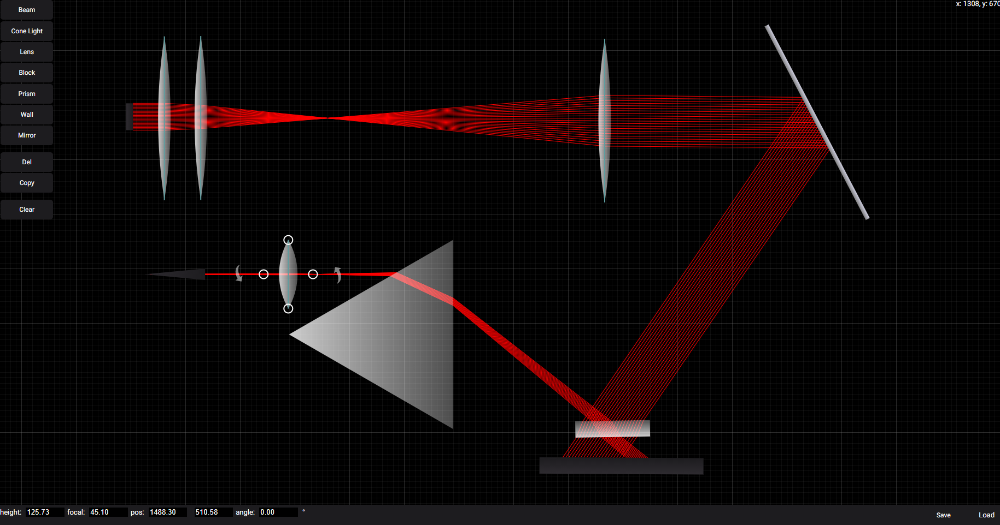

# About

Online open source optics tool for experimenting and teaching geometrical optics. The project was developed after the original desktop sofware (https://openopticsmodule.com) was starting to become more feature rich, to fill the need for a more easily acessible tool with intuitive controls. The project is found at: https://simple.openopticsmodule.com/.



# Developers

- Learn about svelte: https://kit.svelte.dev/docs#introduction

- After cloning with git, run the following to start a local development server.

```bash
    npm install
    npm run dev
```

